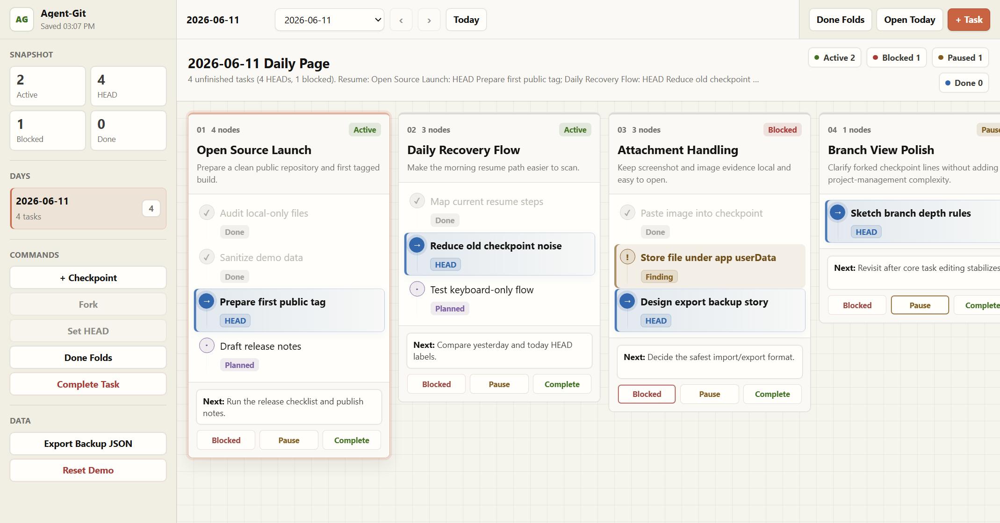

# Agent-Git

<p align="center">
  
</p>

<p align="center">
  <a href="https://github.com/Zippppo/Agent-Git/releases/latest"></a>
  
  <a href="LICENSE"></a>
  
</p>

Agent-Git is a local-first desktop workbench for exploratory work. It gives
each day a Git-style task map, with checkpoints, `HEAD`, forks, findings, and
next steps in one recoverable view.

It is built for the kind of work that does not move in a straight line:
research, debugging, product exploration, experiments, agent runs, and any
project where yesterday's reasoning matters as much as today's todo.

<p align="center">
  <a href="https://github.com/Zippppo/Agent-Git/releases/latest"><strong>Download the latest Windows release</strong></a>
  ·
  <a href="PRODUCT.md">Product direction</a>
  ·
  <a href="CONTRIBUTING.md">Contributing</a>
</p>

## What It Feels Like

<p align="center">
  
</p>

Instead of another flat todo list, Agent-Git gives you a daily map:

- Task roots sit side by side, so parallel work streams stay visible.
- Checkpoints record decisions, completed steps, findings, and planned moves.
- `HEAD` marks exactly where each task should continue.
- Forks preserve alternate routes without muddying the main path.
- Done work can fold away, while the reasoning remains recoverable.

## Why It Exists

Complex work branches, stalls, loops back, and leaves evidence behind. A normal
todo app usually remembers the next action, but not why that action is the
right one.

Agent-Git is optimized for one morning question: where did I leave off, and
what should I trust as the current state?

## Highlights

- Local-first desktop app with no accounts, telemetry, analytics, or backend.
- Daily snapshot page that carries unfinished work forward.
- Horizontal task map with vertical checkpoint timelines.
- Checkpoint states: Planned, Done, `HEAD`, Finding, Abandoned.
- Task states: Active, Blocked, Paused, Done.
- Keyboard-first growth: `Enter` adds a checkpoint, `Ctrl+Enter` forks, and
  `Space` edits inline.
- Drag reorder for tasks and checkpoints.
- Image attachments in the Electron app.
- JSON export for backup and debugging.
- Windows installer and zip packages from the release workflow.

## Install

Windows packages are produced by the GitHub Actions release workflow whenever a
`v*` tag is pushed.

1. Open [Releases](https://github.com/Zippppo/Agent-Git/releases/latest).
2. Download `Agent-Git-0.1.0-win-x64.exe` for the installer, or the Windows
   `.zip` for a portable package.
3. Run Agent-Git. The app stores its current MVP data locally.

Unsigned Windows builds may show a SmartScreen warning until the project adds a
production code-signing certificate.

## Development

Requirements:

- Node.js 20 or newer.
- npm.

Install dependencies:

```bash
npm install
```

Start the desktop app in development mode:

```bash
npm run dev
```

Run the browser renderer only:

```bash
npm run web:dev
```

Run checks:

```bash
npm test
npm run typecheck
npm run build
```

## Packaging

Build an unpacked desktop app:

```bash
npm run desktop:build
```

On Windows, the unpacked executable is created at:

```text
release/win-unpacked/Agent-Git.exe
```

Build Windows distributables locally:

```bash
npm run desktop:dist:win
```

Build all platform targets supported by the current host:

```bash
npm run desktop:dist
```

The Windows release workflow runs typecheck, tests, and packaging on
`windows-latest`, then uploads `.exe`, `.zip`, `.blockmap`, and `latest*.yml`
artifacts. On tagged pushes, those files are attached to a GitHub Release.

## Privacy And Data

Agent-Git is local-first. The current app does not include accounts, cloud sync,
telemetry, analytics, or a remote backend.

Current storage locations:

```text
localStorage:
  agent-git:mvp:v1
  agent-git:mvp:prefs:v1

Electron userData:
  attachments/
```

The JSON export action downloads a local backup of the app state. Treat exported
JSON files as personal data if your tasks contain sensitive notes.

## Project Layout

```text
.
|- .github/workflows/
|  `- windows-release.yml     # Windows release automation
|- build/
|  |- icon.ico                # Windows app icon
|  |- icon.png
|  `- icon.svg
|- docs/
|  |- assets/                 # README visuals
|  `- mvp-single-file.html    # Preserved original single-file prototype
|- electron/
|  |- main.mjs                # Electron desktop main process
|  |- preload.cjs             # Isolated renderer bridge
|  `- zoom-shortcuts.mjs      # Shared zoom shortcut logic
|- src/
|  |- main.ts                 # App behavior and rendering
|  `- styles.css              # App styles migrated from the MVP
|- test/
|  `- zoom-shortcuts.test.mjs # Node test suite
|- PRODUCT.md                 # Product definition and roadmap
|- CONTRIBUTING.md            # Contribution guide
|- SECURITY.md                # Security policy
|- CHANGELOG.md               # Release notes
`- package.json
```

## Current Limits

Agent-Git is still pre-1.0:

- The renderer is still a large migrated file and needs domain, storage, and
  view modules.
- Cross-day lineage is not fully modeled yet. Inherited tasks are currently
  copied into the new day.
- Forks are represented as visual indentation, not a complete branch tree.
- Search, import, archive, and undo history are still limited.
- JSON export is useful for development backup, but it is not yet a polished
  end-user backup format.

See [PRODUCT.md](PRODUCT.md) for the full product direction.

## Contributing

Contributions are welcome while the project is still small and evolving. Start
with [CONTRIBUTING.md](CONTRIBUTING.md) before opening a pull request.

For security issues, see [SECURITY.md](SECURITY.md).

## License

Agent-Git is released under the [MIT License](LICENSE).
